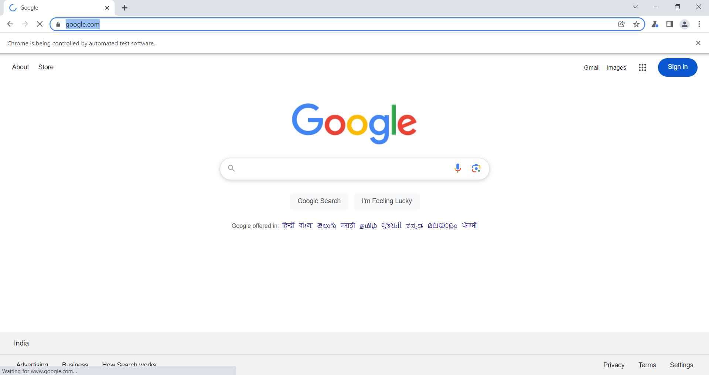

# Open Website Automation 🚀  
### Powered by Puppeteer and Node.js  

### About 📖  
This project demonstrates browser automation using **Node.js** and **Puppeteer**, a powerful library for controlling headless Chrome. When you run this script, the following tasks are executed automatically:  

1. Opens the [Google](https://www.google.com/) website in a browser.  
2. Types "geeksforgeeks" into the search bar and presses "Enter".  
3. Clicks on the first search result to navigate to the [GeeksforGeeks](https://www.geeksforgeeks.org/) homepage.  

---

### How to Run This Project ⚙️  
Follow these steps to execute the automation script on your local environment:  

1. **Clone the Repository**:  
   ```bash
   git clone https://github.com/Prince260602/open-website-automation.git
   cd open-website-automation
   npm install
   node index.js


### Features 🔥
Browser Automation: Leverages Puppeteer to perform browser-based tasks.
Modern JavaScript: Utilizes ES7 features such as async/await for clean and efficient asynchronous operations.
Customizable: You can modify the script to automate other tasks or interact with different websites.

### Technical Insights 💡

Puppeteer Module:
This project uses the Puppeteer library, which provides a high-level API to control headless Chrome browsers. Puppeteer enables seamless browser automation, interaction, and testing.

JavaScript Promises & Async/Await:
The script implements the Promise concept of JavaScript, ensuring smooth asynchronous operations. The use of async/await enhances readability and makes the script easy to debug and maintain.

### Prerequisites 🛠️
Before running the project, ensure that you have the following installed on your system:

Node.js: Download and install Node.js from nodejs.org.
npm: Installed automatically with Node.js.
Contribution 🤝
Want to contribute to this project? Feel free to fork the repository, create a new branch, and submit a pull request. Suggestions and improvements are always welcome!

### Screenshots 📷



